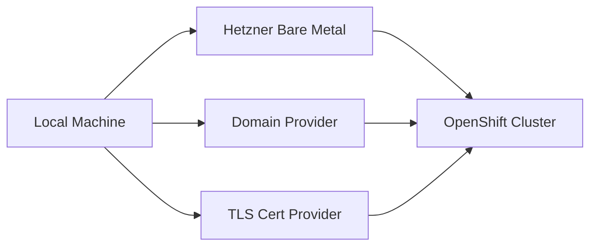
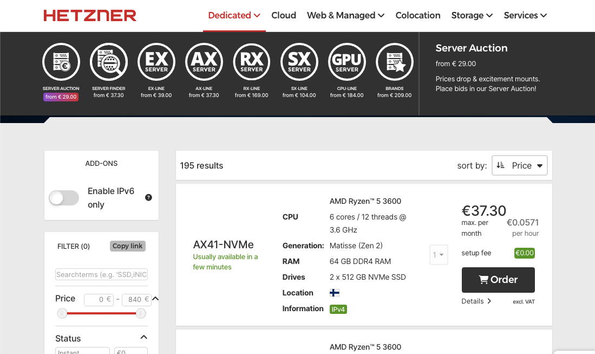
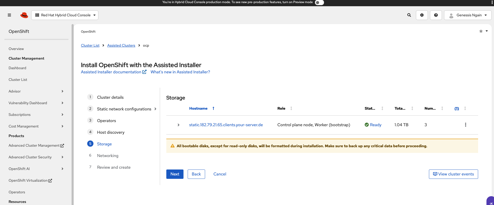
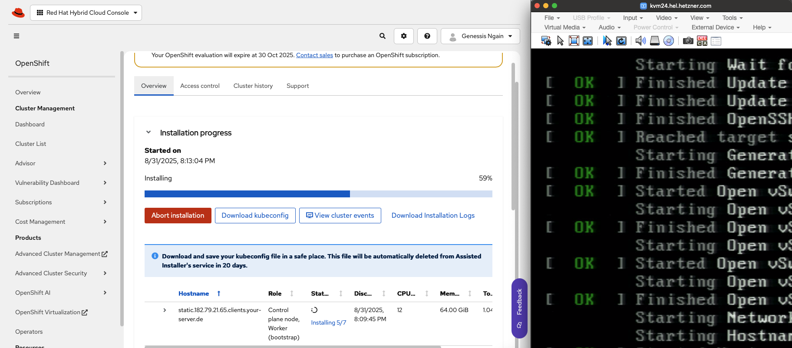
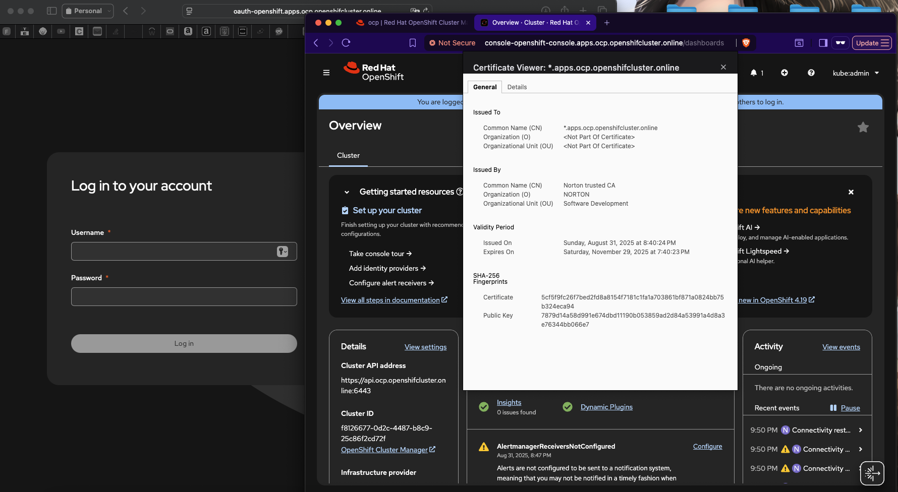

# OpenShift on Hetzner Bare Metal with Assisted Installer 
[](https://www.redhat.com/en/technologies/cloud-computing/openshift)
[](https://www.hetzner.com/dedicated-root-server)
[](https://letsencrypt.org/)
[](#)

A **step-by-step guide** to building a **Single Node OpenShift (SNO)** cluster on a **€37.30 (~$44) Hetzner Dedicated AX41-NVMe bare-metal server** using the **Red Hat Assisted Installer**.  

Most guides assume you either have a workstation with excessive hardware or that you’ll settle for Red Hat’s sandbox, which blocks real admin work. If you want the full OpenShift experience API, console, TLS, and user management—without buying a rack of servers, this guide shows how to build a Single Node OpenShift (SNO) cluster on a $44 Hetzner bare-metal server using the Assisted Installer.
It’s affordable, repeatable, and ideal for hands-on learning.
---

## 📑 Table of Contents
1. [Prerequisites](#-prerequisites)  
2. [Step 1 — Order the Bare-Metal Server](#step-1--order-the-bare-metal-server)  
3. [Step 2 — Configure Domain DNS](#step-2--configure-domain-dns)  
4. [Step 3 — Configure the Assisted Installer](#step-3--configure-the-assisted-installer)  
5. [Step 4 — Mount the ISO](#step-4--mount-the-iso)  
6. [Step 5 — Install the Cluster](#step-5--install-the-cluster)  
7. [Step 6 — Verify Access](#step-6--verify-access)  
8. [Step 7 — Secure and Harden the Cluster](#step-7--secure-and-harden-the-cluster)  
9. [Final Notes](#final-notes)

---
## 📌 Prerequisites  

1. **Red Hat Account** — <https://cloud.redhat.com>  
   - Free developer account (60-day trial, pull secret, Assisted Installer access).  

2. **Hetzner Account** — <https://robot.hetzner.com>  
   - Order and manage bare-metal servers.  

3. **Domain you control(e.g example.com) with two A records to your server’s public IPv4:** 
   - Add DNS records:  

   | Host/Name | Type | Value     | TTL  |
   |-----------|------|-----------|------|
   | api.ocp   | A    | public-IP | 60s  |
   | \*.apps.ocp | A  | public-IP | 60s  |

---

## Step 1 — Order the Bare-Metal Server  

- Recommended: **AX41-NVMe** (AMD Ryzen 5 3600, 64 GB RAM, 2×512 GB NVMe).
- Location doesn’t matter for lab work (Finland is fine).
- Select **Public Key** as the access method and upload your SSH public key.



After provisioning, SSH into your server:  

```bash
chmod 600 ~/.ssh/<private-key>
ssh -i ~/.ssh/<private-key> root@<public-ip>
```
If password prompts appear, force key-only:
```bash
ssh -i ~/.ssh/<private-key> \
  -o IdentitiesOnly=yes \
  -o PreferredAuthentications=publickey \
  -o PasswordAuthentication=no \
  root@<public-ip>
```
---
## Step 2 — Configure Domain DNS
Create the two A records from Prerequisites (api.ocp, *.apps.ocp) to the server’s public IPv4. Propagation for low TTLs (60s) is usually quick.

## Step 3 — Configure the Assisted Installer
Right after checkout:
- Go to the <https://console.redhat.com/openshift/assisted-installer>
- Navigate to Assisted Installer → Create Cluster.
- Fill out the form as follows:

```bash
Cluster name: ocp
Base domain: <your-domain>
CPU architecture: x86_64
High availability mode: Single Node
Pull secret: <your-pull-secret>
SSH public key: <your-ssh-public-key>
Role: Control plane
Run workloads on control plane: ON
Install disk: nvme0n1
Networking: User-Managed Networking (UMN)
  - API VIP = blank
  - Ingress VIP = blank
DNS: 1.1.1.1
```
Checking system information on the Hetzner server

Use these commands to gather MAC, IP, and gateway info:
```bash
# Interface name(s), MACs
ip -br link

# IPv4 address with CIDR
ip -4 -o addr show dev eth0 | awk '{print $4}'

# MAC address
cat /sys/class/net/eth0/address

# Default gateway
ip route | awk '/^default/ {print $3}'

# Current DNS resolvers
grep -E '^nameserver' /etc/resolv.conf | awk '{print $2}'
```
### Generate the Discovery ISO
In the Host Discovery section:
- Click Add Host → Full Image File Provisioner.
- In the SSH field, paste your public key.
- Leave proxy and trusted certificates unchecked.
- Click Generate Discovery ISO → download it.
- Mount the ISO in LARA (Hetzner KVM), set boot order to CD first, then reboot.

---
## Step 4 — Mount the Discovery ISO
You have two options:
### Option A: Request Hetzner Support
- Log into Hetzner Robot<https://robot.hetzner.com>
- Go to Servers → (your server) → Support tab → Remote Console.
- Fill out the form and request a KVM session.
In the comments, paste something like this:

```bash
Hello, I'd like to mount an ISO on this server, please prepare and mount the following ISO for my KVM session:

Direct ISO URL: <paste the "Full image file" discovery ISO link from Assisted Installer>

Server: AX41-NVMe [ID ######]
Public IPv4: <server-ip>

Requests:
1. Mount the ISO as virtual CD/USB (UEFI OK).
2. Set boot order to Virtual Media first and reboot so the server boots the ISO once.
3. After booting the ISO, set boot order back to Disk first (you may unmount the ISO).
```
Hetzner will reply with temporary KVM credentials and the ISO mounted.
### Option B: Mount the ISO Yourself via LARA/KVM
If you already have KVM credentials:
- Log into the KVM console.
- Go to Interfaces → Virtual Media.
- Upload the Discovery ISO from Red Hat.
- Set boot order to Virtual Media first, reboot, and confirm the system boots into the ISO.
- After booting, change the order back to Disk first (so it boots into RHCOS after install).

Once the node boots successfully, it will appear as Ready in the Assisted Installer UI.




## Step 5 — Install the Cluster
Click Install Cluster.
The installer writes RHCOS to /dev/nvme0n1, reboots, bootstraps, and configures OpenShift.



Once complete, download:
	-	kubeconfig
	-	kubeadmin password

## Step 6 — Verify Access
On your laptop:
```bash
# CLI
brew install openshift-cli     # macOS
choco install openshift-cli    # Windows

# Configure kubeconfig
export KUBECONFIG="$PWD/kubeconfig"

# Verify
oc whoami
oc get nodes
```
You should see the single node Ready. API and console should resolve via your domain.

## Step 7 — Secure and Harden
Fix TLS warnings (Let’s Encrypt DNS-01



Issue a wildcard cert for *.apps.ocp.<domain> and set it as the default Ingress cert.
```bash
# macOS
brew install certbot
# Windows
choco install certbot

sudo certbot certonly --manual --preferred-challenges dns \
  -d "*.apps.ocp.<domain>" \
  --agree-tos -m you@example.com --no-eff-email
```
Add the TXT record certbot prints to your domain:
`_acme-challenge.apps.ocp.<domain>   TXT   <token>`

Verify and then patch Ingress:
```bash
# Verify DNS
dig +short TXT _acme-challenge.apps.ocp.<domain>

# Cert locations (once issued):
# /etc/letsencrypt/live/apps.ocp.<domain>/fullchain.pem
# /etc/letsencrypt/live/apps.ocp.<domain>/privkey.pem

# Create secret + set as default cert
oc -n openshift-ingress create secret tls wildcard-apps \
  --cert=fullchain.pem --key=privkey.pem

oc -n openshift-ingress-operator patch ingresscontroller/default \
  --type=merge -p '{"spec":{"defaultCertificate":{"name":"wildcard-apps"}}}'

# Wait for rollout
oc -n openshift-ingress rollout status deploy/router-default
```
After TLS applied (valid certificate):
If you want a before TLS screenshot (browser warning), capture it and add another image under this section.


## Replace kubeadmin with a real user (htpasswd)
```bash
# macOS
brew install httpd

# Create an htpasswd file
htpasswd -cbB users.htpasswd admin StrongPassword123

# Create the secret in OpenShift
oc -n openshift-config create secret generic htpasswd-secret \
  --from-file=htpasswd=users.htpasswd
```
Apply OAuth:
```bash
apiVersion: config.openshift.io/v1
kind: OAuth
metadata:
  name: cluster
spec:
  identityProviders:
  - name: local
    mappingMethod: claim
    type: HTPasswd
    htpasswd:
      fileData:
        name: htpasswd-secret
```
```bash
oc apply -f oauth.yaml

# Grant admin
oc adm policy add-cluster-role-to-user cluster-admin admin

# Test
oc login https://api.ocp.<domain>:6443 -u admin -p StrongPassword123
oc whoami

# Remove bootstrap account
oc delete secret kubeadmin -n kube-system
```
### Lock down network exposure
Only these inbound ports are required:
22/tcp — SSH
6443/tcp — OpenShift API
80/tcp — HTTP ingress
443/tcp — HTTPS ingre
